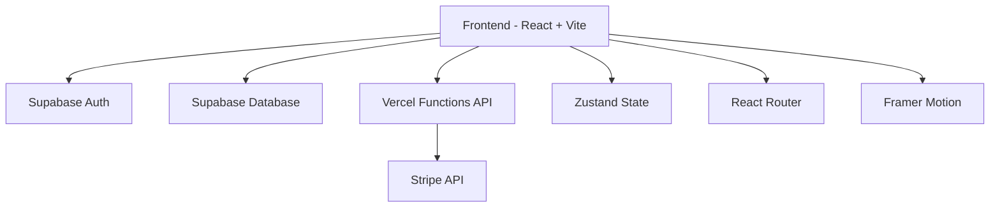

# 📋 Parecer Técnico de Arquitetura - OrientoHub

**Data:** 20 de Novembro de 2025  
**Versão:** 1.0  
**Arquiteto Responsável:** Análise Técnica Completa  
**Status do Projeto:** Em Desenvolvimento Ativo

---

## 📊 Executive Summary

O **OrientoHub** é uma plataforma SaaS gamificada para construção de startups, desenvolvida com React + TypeScript + Vite, integrada com Supabase (backend) e Stripe (pagamentos). O projeto apresenta uma arquitetura moderna e bem estruturada, mas requer ajustes críticos em segurança, performance, testes e escalabilidade antes do lançamento em produção.

### Métricas Atuais
- **31 páginas** implementadas
- **18 componentes** reutilizáveis
- **Stack:** React 18.3, TypeScript 5.5, Vite 5.4, Supabase, Stripe
- **Deployment:** Vercel (frontend) + Vercel Functions (API)
- **Cobertura de Testes:** 0% ⚠️

---

## 🏗️ Arquitetura Atual

### Stack Tecnológico



#### Frontend
- **Framework:** React 18.3.1 + TypeScript 5.5
- **Build Tool:** Vite 5.4.2
- **Styling:** TailwindCSS 3.4.1
- **Animações:** Framer Motion 11.0.8
- **Roteamento:** React Router DOM 6.22.2
- **Estado Global:** Zustand 4.5.1
- **i18n:** i18next 23.10.0

#### Backend & Serviços
- **Database:** Supabase (PostgreSQL)
- **Auth:** Supabase Auth
- **Storage:** Supabase Storage
- **Payments:** Stripe 14.25.0
- **API:** Vercel Serverless Functions

#### Bibliotecas Auxiliares
- **Charts:** Recharts 3.3.0
- **PDF:** jsPDF 2.5.2
- **Calendar:** React Calendar 6.0.0
- **Icons:** Lucide React 0.344.0

### Estrutura de Diretórios

```
src/
├── components/        # 18 componentes reutilizáveis
│   ├── auth/         # Autenticação (ProtectedRoute, FounderRoute)
│   ├── ui/           # Componentes de UI
│   └── ...
├── pages/            # 31 páginas da aplicação
├── layouts/          # MainLayout, DashboardLayout
├── stores/           # Zustand stores (auth, projects)
├── services/         # Serviços de API
├── hooks/            # Custom hooks (4)
├── contexts/         # React contexts
├── lib/              # Configurações (Stripe)
├── i18n/             # Internacionalização
├── utils/            # Utilitários
└── styles/           # Estilos globais
```

---

## 🔴 Problemas Críticos Identificados

### 1. **Segurança** (Prioridade: CRÍTICA)

#### 1.1 Exposição de Secrets
```typescript
// ❌ PROBLEMA: Chaves expostas no código
const STRIPE_PUBLIC_KEY = "pk_test_..." // Hardcoded
```

**Impacto:** Vazamento de credenciais, acesso não autorizado  
**Solução:**
- Migrar todas as chaves para variáveis de ambiente
- Implementar `.env.local` para desenvolvimento
- Configurar secrets no Vercel para produção
- Adicionar validação de env vars no startup

#### 1.2 CORS e CSP
**Problema:** Falta de políticas de segurança HTTP  
**Solução:**
- Implementar Content Security Policy (CSP)
- Configurar CORS adequadamente nas Vercel Functions
- Adicionar rate limiting nas APIs

#### 1.3 Validação de Input
**Problema:** Validação inconsistente de dados do usuário  
**Solução:**
- Implementar Zod para validação de schemas
- Sanitizar inputs antes de enviar ao backend
- Validar tipos no TypeScript de forma mais rigorosa

### 2. **Performance** (Prioridade: ALTA)

#### 2.1 Bundle Size
**Problema:** Bundle grande sem code splitting  
**Análise Estimada:**
- Framer Motion: ~100KB
- Recharts: ~150KB
- React + React DOM: ~140KB
- **Total estimado:** ~800KB+ (não otimizado)

**Solução:**
```typescript
// Implementar lazy loading
const DashboardPage = lazy(() => import('./pages/DashboardPage'));
const FrameworksPage = lazy(() => import('./pages/FrameworksPage'));

// Route-based code splitting
<Suspense fallback={<LoadingSpinner />}>
  <Routes>
    <Route path="/dashboard" element={<DashboardPage />} />
  </Routes>
</Suspense>
```

#### 2.2 Imagens Não Otimizadas
**Problema:** Imagens sem lazy loading e otimização  
**Solução:**
- Implementar lazy loading de imagens
- Usar formatos modernos (WebP, AVIF)
- Adicionar placeholders com blur
- Implementar CDN para assets

#### 2.3 Re-renders Desnecessários
**Problema:** Componentes re-renderizando sem necessidade  
**Solução:**
- Implementar React.memo em componentes pesados
- Usar useMemo e useCallback estrategicamente
- Otimizar Zustand stores com selectors

### 3. **Testes** (Prioridade: CRÍTICA)

#### 3.1 Cobertura Zero
**Problema:** Nenhum teste implementado  
**Impacto:** Alto risco de bugs em produção, refatoração perigosa

**Solução - Roadmap de Testes:**

```typescript
// 1. Testes Unitários (Vitest)
describe('FeatureCard', () => {
  it('should render with correct props', () => {
    render(<FeatureCard title="Test" description="Desc" />);
    expect(screen.getByText('Test')).toBeInTheDocument();
  });
});

// 2. Testes de Integração (React Testing Library)
describe('CheckoutFlow', () => {
  it('should complete payment successfully', async () => {
    // Test Stripe integration
  });
});

// 3. Testes E2E (Playwright)
test('user can create a project', async ({ page }) => {
  await page.goto('/dashboard');
  await page.click('text=Novo Projeto');
  // ...
});
```

**Ferramentas Recomendadas:**
- **Unit/Integration:** Vitest + React Testing Library
- **E2E:** Playwright
- **Coverage:** c8 ou Istanbul
- **Meta:** 80% de cobertura mínima

### 4. **Acessibilidade** (Prioridade: MÉDIA)

#### Problemas Identificados:
- ❌ Falta de atributos ARIA
- ❌ Navegação por teclado incompleta
- ❌ Contraste de cores não validado
- ❌ Sem suporte a screen readers

**Solução:**
```typescript
// Implementar acessibilidade
<button
  aria-label="Fechar modal"
  aria-pressed={isOpen}
  role="button"
  tabIndex={0}
  onKeyDown={handleKeyDown}
>
  <X className="w-5 h-5" aria-hidden="true" />
</button>
```

**Ferramentas:**
- axe DevTools para auditoria
- WAVE para validação
- Lighthouse para score de acessibilidade

### 5. **Monitoramento e Observabilidade** (Prioridade: ALTA)

#### 5.1 Falta de Error Tracking
**Problema:** Erros em produção não são capturados  
**Solução:**
- Implementar Sentry para error tracking
- Adicionar logging estruturado
- Implementar alertas para erros críticos

#### 5.2 Analytics
**Problema:** Sem métricas de uso  
**Solução:**
- Implementar Google Analytics 4 ou Mixpanel
- Tracking de eventos customizados
- Funil de conversão para checkout

#### 5.3 Performance Monitoring
**Solução:**
- Implementar Web Vitals tracking
- Monitorar Core Web Vitals (LCP, FID, CLS)
- Alertas para degradação de performance

---

## ✅ Pontos Fortes da Arquitetura

### 1. **Organização de Código**
- ✅ Estrutura de pastas clara e escalável
- ✅ Separação de responsabilidades bem definida
- ✅ Componentes reutilizáveis

### 2. **Stack Moderna**
- ✅ TypeScript para type safety
- ✅ Vite para build rápido
- ✅ Supabase para backend completo
- ✅ Stripe para pagamentos confiáveis

### 3. **UX/UI**
- ✅ Design system consistente
- ✅ Animações suaves com Framer Motion
- ✅ Responsividade implementada
- ✅ Dark mode suportado

### 4. **Internacionalização**
- ✅ i18next configurado
- ✅ Suporte multi-idioma preparado

---

## 🎯 Roadmap de Melhorias

### Fase 1: Fundação (2-3 semanas) - CRÍTICO

#### Sprint 1: Segurança e Infraestrutura
- [ ] Migrar todas as secrets para variáveis de ambiente
- [ ] Implementar validação com Zod
- [ ] Configurar CSP e CORS
- [ ] Implementar rate limiting
- [ ] Adicionar HTTPS obrigatório

#### Sprint 2: Testes Fundamentais
- [ ] Configurar Vitest + React Testing Library
- [ ] Escrever testes para componentes críticos (Auth, Checkout)
- [ ] Implementar testes de integração para fluxos principais
- [ ] Configurar CI/CD com testes automáticos
- [ ] Meta: 40% de cobertura

### Fase 2: Performance (2 semanas) - ALTA

#### Sprint 3: Otimização de Bundle
- [ ] Implementar code splitting por rota
- [ ] Lazy loading de componentes pesados
- [ ] Otimizar imports (tree shaking)
- [ ] Analisar bundle com Vite Bundle Analyzer
- [ ] Meta: Reduzir bundle em 40%

#### Sprint 4: Assets e Rendering
- [ ] Otimizar imagens (WebP, lazy loading)
- [ ] Implementar React.memo em componentes pesados
- [ ] Otimizar re-renders com useMemo/useCallback
- [ ] Implementar virtual scrolling para listas grandes
- [ ] Meta: LCP < 2.5s, FID < 100ms

### Fase 3: Observabilidade (1 semana) - ALTA

#### Sprint 5: Monitoramento
- [ ] Integrar Sentry para error tracking
- [ ] Implementar Google Analytics 4
- [ ] Configurar Web Vitals tracking
- [ ] Criar dashboard de métricas
- [ ] Configurar alertas críticos

### Fase 4: Qualidade (2 semanas) - MÉDIA

#### Sprint 6: Acessibilidade
- [ ] Auditoria completa com axe DevTools
- [ ] Implementar atributos ARIA
- [ ] Melhorar navegação por teclado
- [ ] Validar contraste de cores (WCAG AA)
- [ ] Testar com screen readers
- [ ] Meta: Lighthouse Accessibility > 90

#### Sprint 7: Testes Avançados
- [ ] Implementar testes E2E com Playwright
- [ ] Testes de performance automatizados
- [ ] Testes de acessibilidade automatizados
- [ ] Meta: 80% de cobertura total

### Fase 5: Escalabilidade (2-3 semanas) - MÉDIA

#### Sprint 8: Arquitetura
- [ ] Implementar cache strategy (React Query ou SWR)
- [ ] Otimizar queries do Supabase
- [ ] Implementar paginação em todas as listas
- [ ] Adicionar infinite scroll onde apropriado
- [ ] Implementar debounce em searches

#### Sprint 9: DevOps
- [ ] Configurar staging environment
- [ ] Implementar preview deployments
- [ ] Configurar backup automático do Supabase
- [ ] Implementar rollback strategy
- [ ] Documentar runbooks de incidentes

---

## 🔧 Melhorias Técnicas Específicas

### 1. **State Management**

#### Problema Atual:
```typescript
// Zustand store sem persistência
export const useAuthStore = create((set) => ({
  user: null,
  setUser: (user) => set({ user }),
}));
```

#### Solução Recomendada:
```typescript
import { persist } from 'zustand/middleware';

export const useAuthStore = create(
  persist(
    (set) => ({
      user: null,
      setUser: (user) => set({ user }),
    }),
    {
      name: 'auth-storage',
      partialize: (state) => ({ user: state.user }), // Apenas persistir user
    }
  )
);
```

### 2. **API Layer**

#### Implementar Abstração:
```typescript
// services/api.ts
import { createClient } from '@supabase/supabase-js';

class ApiClient {
  private supabase;

  constructor() {
    this.supabase = createClient(
      import.meta.env.VITE_SUPABASE_URL,
      import.meta.env.VITE_SUPABASE_ANON_KEY
    );
  }

  async getProjects() {
    const { data, error } = await this.supabase
      .from('projects')
      .select('*')
      .order('created_at', { ascending: false });
    
    if (error) throw new ApiError(error.message);
    return data;
  }
}

export const api = new ApiClient();
```

### 3. **Error Handling**

#### Implementar Error Boundaries:
```typescript
// components/ErrorBoundary.tsx
class ErrorBoundary extends React.Component {
  componentDidCatch(error, errorInfo) {
    // Log para Sentry
    Sentry.captureException(error, { extra: errorInfo });
  }

  render() {
    if (this.state.hasError) {
      return <ErrorFallback />;
    }
    return this.props.children;
  }
}
```

### 4. **Form Validation**

#### Implementar Zod:
```typescript
import { z } from 'zod';

const projectSchema = z.object({
  name: z.string().min(3, 'Nome deve ter no mínimo 3 caracteres'),
  description: z.string().max(500, 'Descrição muito longa'),
  category: z.enum(['tech', 'health', 'education']),
});

type ProjectForm = z.infer<typeof projectSchema>;
```

---

## 📈 Métricas de Sucesso

### Performance
- **LCP (Largest Contentful Paint):** < 2.5s
- **FID (First Input Delay):** < 100ms
- **CLS (Cumulative Layout Shift):** < 0.1
- **TTI (Time to Interactive):** < 3.5s
- **Bundle Size:** < 500KB (gzipped)

### Qualidade
- **Cobertura de Testes:** > 80%
- **Lighthouse Score:** > 90 (todas as categorias)
- **TypeScript Strict Mode:** Habilitado
- **ESLint Errors:** 0

### Segurança
- **OWASP Top 10:** Mitigado
- **Dependências Vulneráveis:** 0
- **Secrets Expostos:** 0

### Acessibilidade
- **WCAG 2.1 Level:** AA
- **Lighthouse Accessibility:** > 90
- **Keyboard Navigation:** 100%

---

## 💰 Estimativa de Esforço

| Fase | Sprints | Duração | Desenvolvedores | Esforço Total |
|------|---------|---------|-----------------|---------------|
| Fase 1: Fundação | 2 | 3 semanas | 2 devs | 120h |
| Fase 2: Performance | 2 | 2 semanas | 1-2 devs | 80h |
| Fase 3: Observabilidade | 1 | 1 semana | 1 dev | 40h |
| Fase 4: Qualidade | 2 | 2 semanas | 2 devs | 80h |
| Fase 5: Escalabilidade | 2 | 3 semanas | 2 devs | 120h |
| **TOTAL** | **9** | **11 semanas** | **2 devs** | **440h** |

---

## 🚨 Riscos Identificados

### Alto Risco
1. **Falta de Testes:** Bugs críticos podem passar despercebidos
2. **Secrets Expostos:** Vulnerabilidade de segurança grave
3. **Performance:** Bundle grande pode afetar conversão

### Médio Risco
1. **Escalabilidade:** Queries não otimizadas podem causar lentidão
2. **Acessibilidade:** Pode excluir usuários com deficiências
3. **Monitoramento:** Dificuldade em diagnosticar problemas em produção

### Baixo Risco
1. **i18n:** Implementação já preparada
2. **Design System:** Bem estruturado
3. **Deployment:** Vercel é confiável

---

## 🎓 Recomendações de Arquitetura

### 1. **Adotar React Query**
```typescript
// Melhor gerenciamento de cache e estado servidor
const { data, isLoading } = useQuery({
  queryKey: ['projects'],
  queryFn: () => api.getProjects(),
  staleTime: 5 * 60 * 1000, // 5 minutos
});
```

### 2. **Implementar Feature Flags**
```typescript
// Controle de features em produção
import { useFeatureFlag } from './hooks/useFeatureFlag';

const NewFeature = () => {
  const isEnabled = useFeatureFlag('new-dashboard');
  if (!isEnabled) return null;
  return <NewDashboard />;
};
```

### 3. **Micro-frontends (Futuro)**
Para escalar, considerar:
- Module Federation (Webpack 5)
- Separar Academy, Dashboard, Marketing em apps independentes

### 4. **API Gateway**
Implementar camada de API para:
- Rate limiting centralizado
- Autenticação unificada
- Logging e monitoring
- Cache distribuído

---

## 📚 Documentação Necessária

### Imediato
- [ ] README.md completo com setup
- [ ] CONTRIBUTING.md com guidelines
- [ ] API documentation (Swagger/OpenAPI)
- [ ] Componentes (Storybook)

### Curto Prazo
- [ ] Arquitetura (ADRs - Architecture Decision Records)
- [ ] Runbooks de incidentes
- [ ] Guia de deployment
- [ ] Guia de troubleshooting

### Médio Prazo
- [ ] Onboarding de desenvolvedores
- [ ] Guia de estilo de código
- [ ] Padrões de design
- [ ] Roadmap técnico

---

## 🔄 Próximos Passos Imediatos

### Semana 1
1. **Dia 1-2:** Migrar secrets para env vars
2. **Dia 3-4:** Configurar Vitest e primeiros testes
3. **Dia 5:** Implementar Sentry e error tracking

### Semana 2
1. **Dia 1-2:** Implementar code splitting
2. **Dia 3-4:** Otimizar bundle size
3. **Dia 5:** Configurar CI/CD com testes

### Semana 3
1. **Dia 1-2:** Implementar validação com Zod
2. **Dia 3-4:** Adicionar testes de integração
3. **Dia 5:** Review e ajustes

---

## 📊 Conclusão

O **OrientoHub** possui uma base sólida com stack moderna e arquitetura bem organizada. No entanto, **não está pronto para produção** devido a problemas críticos de:

1. ✅ **Segurança** (secrets expostos)
2. ✅ **Testes** (cobertura zero)
3. ✅ **Performance** (bundle não otimizado)
4. ✅ **Monitoramento** (sem observabilidade)

### Recomendação Final

**🔴 NÃO LANÇAR EM PRODUÇÃO** sem completar pelo menos a **Fase 1 (Fundação)** e **Fase 3 (Observabilidade)**.

**Timeline Mínimo para MVP Seguro:** 4-5 semanas  
**Timeline Ideal para Produção Robusta:** 11 semanas

### Priorização Sugerida

1. **CRÍTICO (Fazer AGORA):** Segurança + Testes Básicos
2. **ALTA (Próximas 2 semanas):** Performance + Monitoramento
3. **MÉDIA (1-2 meses):** Acessibilidade + Testes Avançados
4. **BAIXA (Roadmap futuro):** Escalabilidade + Micro-frontends

---

**Assinatura Técnica:**  
Análise realizada em 20/11/2025  
Próxima revisão recomendada: Após Fase 1 (3 semanas)
